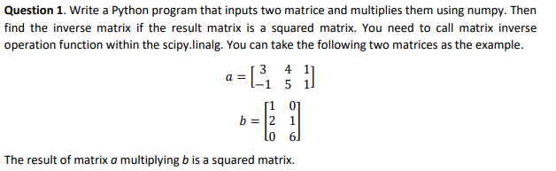

# W01 - Numpy, Scipy, Pandas, Matplotlib, and Scikits

## Week 1 Tutorial

### Question 1



```
#q1

import numpy as np
from scipy import linalg 

a=np.array([[3,4,1],[-1,5,1]])
b=np.array([[1,0],[2,1],[0,6]])

c=a@b #mulitplication nunder numpy, dot product
print(a)
print()

print(b)
print()
print(c)

invc=linalg.inv(c)
print()
print(invc)

```


### Question 2


```
#q2

import numpy as np

from scipy.integrate import quad

result, err=quad(np.sin,0,np.pi)

print(result,err)
```


### Question 3


```
#q3

import numpy as np
from scipy import optimize 
import matplotlib.pyplot as plt
    
def f(x):
    return -0.398*np.exp(-0.415*x)*np.sin(1.26*x)

x=np.arange(0,2.5,0.1)

plt.plot(x,f(x))
plt.show()

result=optimize.minimize(f,x0=0) #initial value 0
print(result)
```


### Question 4


```
# q4

import numpy as np
# Seed the random number generator for reproducibility
np.random.seed(0)
N=100 #100 POINTS

x_data = np.linspace(0, 5, num=100)
y_data = 3.9 * np.sin(1.5 * x_data) + np.random.normal(size=100)


# And plot it
import matplotlib.pyplot as plt
plt.figure(figsize=(6, 4))
plt.scatter(x_data, y_data)

from scipy import optimize

#define fitting function - sine
def test_func(x,a,b):
    return a * np.sin(b * x)

p, p_covariance = optimize.curve_fit(test_func, x_data, y_data,p0=[2,2])
print(p)

#define fitting function - 3rd polynomila
def test_func2(x,a0,a1,a2,a3):
     y=a0+a1*x*2+a2*x**2+a3*x**3
     return y

params, params_covariance = optimize.curve_fit(test_func2, x_data, y_data)
print(params)

yhat=test_func(x_data,p[0],p[1])

yhat2=test_func2(x_data,params[0],params[1],params[2],params[3])

sum=0
sum2=0
for i in range(100):
     sum=sum+(yhat[i]-y_data[i])**2
     sum2=sum2+(yhat2[i]-y_data[i])**2
     
mse=sum/N # mean squared error
mse2=sum2/N

print(mse, mse2)

plt.figure(figsize=(6, 4))
plt.scatter(x_data, y_data, label='Data')

plt.plot(x_data, test_func(x_data, p[0], p[1]),
label='Fitted function -sine')

plt.plot(x_data, test_func2(x_data, params[0], params[1],params[2],params[3]),
label='Fitted function - polynomial')

plt.xlabel(r"$x$")
plt.ylabel(r"$y$")

plt.legend(loc='best')
plt.show()
```


### Question 5


```
#q5

import numpy as np
from scipy import misc
from scipy import ndimage
import matplotlib.pyplot as plt

face=misc.face()
#face=plt.imread('dog.png')

shifted_face=ndimage.shift(face,(50,75,0),mode='nearest')
rotated_face=ndimage.rotate(face,30)

zoomed_face=ndimage.zoom(face,(2,2,1))

plt.imshow(face)
plt.imshow(shifted_face)
plt.imshow(rotated_face)
plt.imshow(zoomed_face)
```


### Question 6


```
#q6

import matplotlib.pyplot as plt
import numpy as np


def func(x):
    return np.log(x+1)

x = np.arange(0.01,10,0.1)
y = func(x)

plt.plot(x,y,'r')


plt.xlim(0,10)

plt.title('Natural logarithm Figure',fontsize=12)

plt.xlabel('x',fontsize=10)
plt.ylabel('ln(x)',fontsize=10)
plt.show()

plt.close()

```


### Question 7


```

#Q7

import numpy as np
import matplotlib.pyplot as plt

x = np.array(["ANZ","CBA","NAB","WBC","Others"])
y = np.array([15.87, 26.10, 17.63, 23.28,17.12])
plt.bar(x,y,color=('red','blue','black','yellow','grey'))
plt.xlabel("bank")
plt.ylabel("market share %")
plt.title("The market share of home loan of Australian banks")
plt.show()

y = np.array([15.87, 26.10, 17.63, 23.28,17.12])
mylabels = ["ANZ(15.87%)", "CBA(26.1%)", "NAB(17.63%)", "WBC(23.28%)","Others(17.12%)"]

plt.pie(y, labels = mylabels)
plt.title("The market share of home loan of Australian banks")
plt.show() 

```

